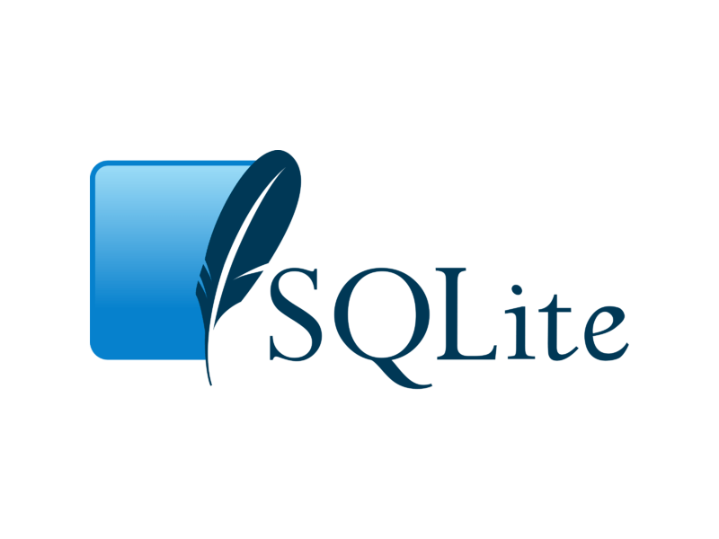

## Requisitos

Para uma melhor compreensão do curso, recomendamos conhecimento básico da linguagem Python.

<h1 align="center">
  
</h1>
<p align="center">
<a href="https://github.com/wendrewdevelop/python4noobs"> Clique aqui para conhecer o Python4noobs </a>
</p>

<hr>
<h1 align="center">
  
</h1>

## Visual Studio Code ##

Neste curso utilizaremos como IDE o Visual Studio Code, por ser uma IDE acessível a todos.

Para isso, instale o VSCode e vamos começar a equipar nosso editor de texto com o que achamos ser necessário para continuar o curso.

<p align="center">
<a href="https://code.visualstudio.com/download"> Clique aqui para fazer o Download </a>
</p>

## IntelliCode ##

<p align="center">

</p>

O IntelliCode torna o preenchimento automático mais inteligente, prevendo qual termo você provavelmente irá usar em
determinada situação. Ele irá mostrar este termo no topo da lista, marcado com um símbolo ☆.

Para facilitar nossa vida, instalaremos o IntelliCode em nossa IDE.

<p align="center">
<a href="https://marketplace.visualstudio.com/items?itemName=VisualStudioExptTeam.vscodeintellicode"> Clique aqui para fazer o Download </a>
</p>

## PyCharm (IDE recomendada) ##

<p align="center">


</p>

Desenvolvido pela JetBrains, o PyCharm é a IDE perfeita para o uso do Python. Com as ferramentas disponíveis nela,
podemos facilitar muito nosso desenvolvimento.

O PyCharm é uma IDE paga, mas se você é estudante de alguma instituição poderá conseguir uma licença de
estudante pela JetBrains utilizando seu e-mail institucional ou atestado de matrícula. 

Saiba mais <a href="https://www.jetbrains.com/community/education/">clicando aqui.</a>

## SQLite ##

<p align="center">



</p>

Precisaremos do SQLite para consultar nosso banco de dados através do terminal no VSCode.

<p align="center">
<a href="https://marketplace.visualstudio.com/items?itemName=alexcvzz.vscode-sqlite"> Clique aqui para fazer o Download </a>
</p>


Para isso, instale no Visual Studio Code através do link acima.

Após a instalação digite o comando *sqlite3* no terminal de sua IDE, se a instalação foi bem sucedida você deverá ter a
seguinte saída:

```bash
sqlite3

SQLite version 3.38.5 2022-05-06 15:25:27
Enter ".help" for usage hints.
Connected to a transient in-memory database.
Use ".open FILENAME" to reopen on a persistent database.
sqlite>
```

Ir para: [2.2 - Ambiente Windows](2-Ambiente-windows.md)
