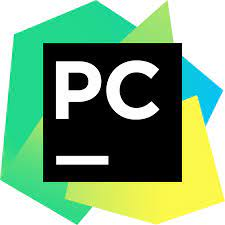
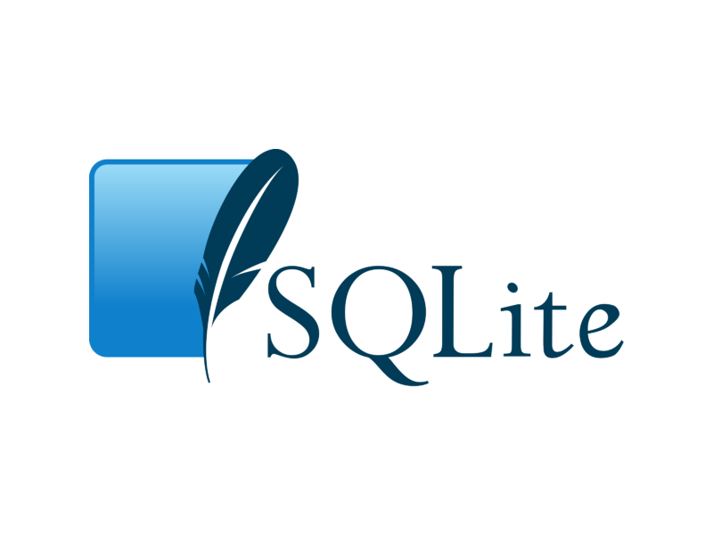

## 2.1 - Requisitos

Para uma melhor compreensão do curso, recomendamos conhecimento básico da linguagem Python.

<h1 align="center">
  
</h1>
<p align="center">
<a href="https://github.com/wendrewdevelop/python4noobs"> Clique aqui para conhecer o Python4noobs </a>
</p>

## 2.2 - Editor de Texto

Como iremos abordar a parte básica do framework Django, não será necessário o uso de uma IDE robusta, então utilizaremos
o editor de texto VSCode para realizarmos os nossos códigos, existem outras opções como SublimeText, Brackets e etc.
Então fique à vontade para utilizar o editor que se sentir mais confortável e realizar os códigos que serão apresentados
ao longo do curso.

<hr>
<h1 align="center">
  
</h1>

## Visual Studio Code ##

<p align="center">
<a href="https://code.visualstudio.com/download"> Clique aqui para fazer o Download </a>
</p>
Vamos começar a equipar nosso editor de texto com o que achamos ser necessário pra ajudar no desenvolvimento ágil com o
Python.
Lembrando que esses plugins <strong>NÃO</strong> impactam no desenvolvimento em si, apenas facilitará pro código ser lido e entendido
por você.

## IntelliCode ##

<p align="center">
<a href="https://marketplace.visualstudio.com/items?itemName=VisualStudioExptTeam.vscodeintellicode"> Clique aqui para fazer o Download </a>
</p>

<p align="center">

</p>

O IntelliCode torna o preenchimento automático mais inteligente, prevendo qual termo você provavelmente irá usar em
determinada situação. Ele irá mostrar este termo no topo da lista, marcado com um símbolo ☆.

## PyCharm (IDE recomendada) ##

<p align="center">



</p>

PyCharm é atualmente a melhor ferramente para produzir código Python pois ela foi desenvolvida exclusivamente para uso
da
linguagem, porém é uma ferramenta paga e custa muitos dólares.

Porém se você é estudante de alguma instituição que forneça e-mails institucionais, você pode conseguir uma licença de
estudante pela JetBrains (empresa responsável pela ferramenta).

Caso você tenha um e-mail institucional, é altamente recomendável procurar saber se ele está elegível a conseguir essa
licença e você pode saber mais <a href="https://www.jetbrains.com/community/education/">clicando aqui.</a>

## SQLite ##

<p align="center">
<a href="https://marketplace.visualstudio.com/items?itemName=alexcvzz.vscode-sqlite"> Clique aqui para fazer o Download </a>
</p>

<p align="center">



</p>

Precisaremos do SQLite para consultar nosso banco de dados.

Para isso, instale no Visual Studio Code através do link acima.

Após a instalação digite o comando *sqlite3* no terminal de sua IDE, se a instalação foi bem sucedida você deverá ter a
seguinte saída:

```bash
sqlite3

SQLite version 3.38.5 2022-05-06 15:25:27
Enter ".help" for usage hints.
Connected to a transient in-memory database.
Use ".open FILENAME" to reopen on a persistent database.
sqlite>
```

Ir para: [2.2 Ambiente Windows](2-Ambiente-windows.md)
