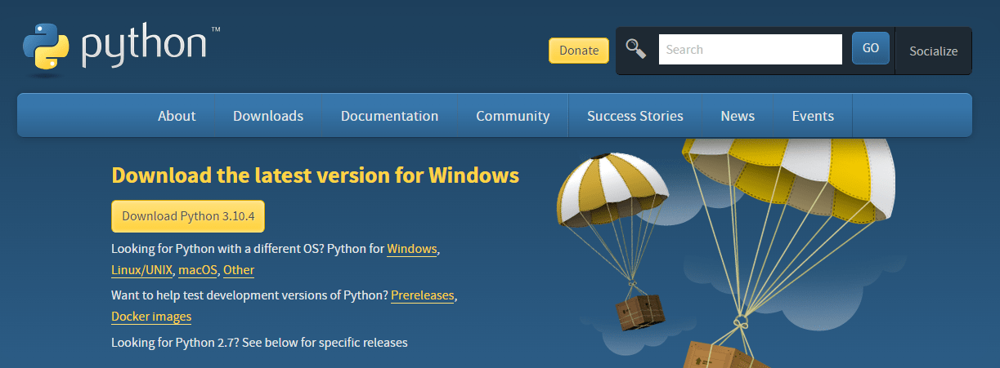
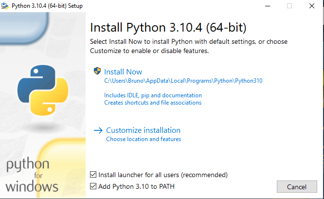

## 2.2 - Ambiente Windows

Para continuação deste curso, será necessário ter instalado o Python em sua máquina.

### 2.2.1 - Passo a passo - Python:

* Baixe o instalável da última versão do Python <a href='https://www.python.org/downloads/'>AQUI</a>;

  

* Execute o instalável do Python que você baixou;
* Faça instalação do Python em "Install Now" (Lembre-se de marcar a caixa "Add Python 3.10 to PATH" para definirmos o
  Python nas
  variáveis de ambiente);

  

* Abra o CMD/Terminal do Windows e digite `python --version`, você verá a versão do Python instalada no seu Windows.

Ir para: [2.3 Ambiente Linux](3-Ambiente-linux.md)