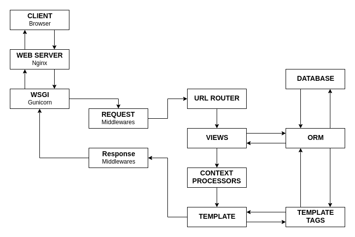

# 3.0 - Como funciona o Django?

Antes de iniciarmos um projeto, vamos entender o funcionamento do Django.

O Django separa o processo em duas fases:
**Request Phase** e **Response Phase**.

Podemos conferir na imagem abaixo o ciclo completo entre as duas fases:

<h3>Request Phase:</h3>

- Quando o usuário faz sua requisição em nosso aplicativo, este request é enviado para um servidor web. Esta é a primeira
etapa da **Request Phase**.

- Após ser enviado para o servidor web, então entramos em outra etapa dentro da **Request Phase**. O request é roteado
para um script chamado WSGI (**Web Server Gateway Interface**), que mapeia os requests HTTP em objetos e envia para o
Django.

- O Django então inicia a etapa chamada de **process_request**.

- O **process_request** é um **Middleware**. O Django trabalha com vários desses, que são "gatilhos" ativados conforme o
fluxo
vai sendo executado dentro da nossa aplicação.

**Exemplo:** Um usuário requisita uma URL que é necessário autenticação, o **Middleware** irá fazer esta verificação e caso
o usuário não esteja logado ou não tenha acesso liberado para esta página, o Django fará uma mudança no fluxo e
retornará outra URL para o usuário.
> Um exemplo de redirecionamento seria para a tela de login caso o usuário não tenha acesso à página requisitada.

- Esta é a última etapa da **Request Phase**. A View é analisada e passa por uma camada de middleware chamada **process_view**.
A View será renderizada e entraremos na **Response Phase**.

<h3>Response Phase:</h3>

- Nesta fase estamos prestes a retornar a informação para o usuário. Então outra middleware será chamada e iniciaremos a
fase de **Response Phase**.

- Toda a informação requisitada pelo usuário já foi processada, agora precisamos retornar o resultado. Então entramos na etapa de **process_template_response** e **Template**.

- O **process_template_response** será responsável por iniciar parte da renderização do template, e com o template
renderizado entraremos no middleware chamado de **process_response**.

- Após isso, no **process_response** teremos um sinal de resposta ao *WSGI* de que está tudo ok, então as informações
solicitadas serão exibidas na tela para o usuário.

### Conclusão:

**No começo pode parecer complexo, mas esta parte técnica te ajudará (e muito!) a entender como o Django se comportará ao longo do curso.**

**Bons estudos !!**

Ir para: [3.1 Componentes do Django](01-MTV.md)
