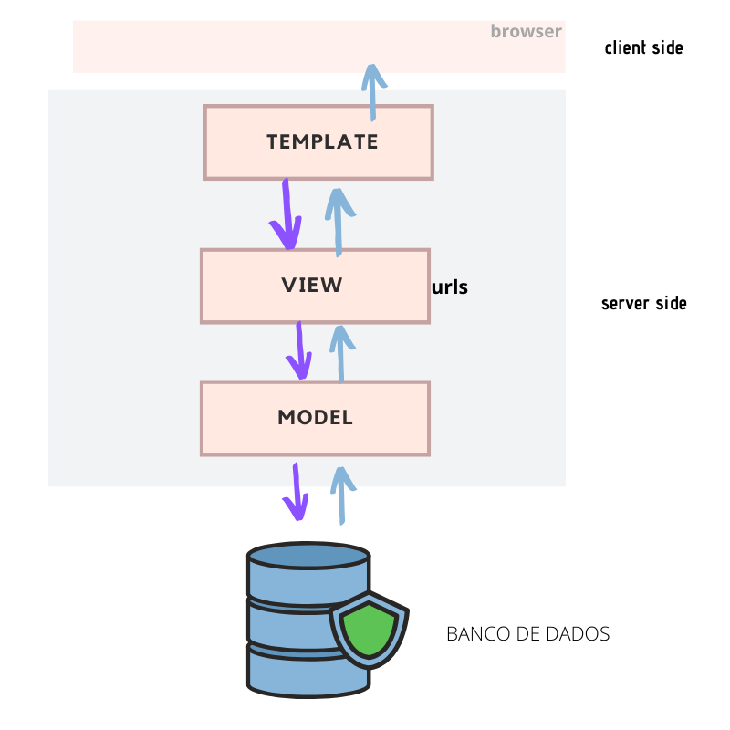

## 3.1 O que é a arquitetura *Model-Template-View (MTV)*?

O Django utiliza uma arquitetura chamada *Model-Template-View* (MTV), que é bem parecida com a estrutura MVC.
A estrutura MVC (*Model-View-Controller*), pode ser encontrada em linguagens de programação como Java, C#, Delphi, Ruby,
PHP, JS.

A estrutura MTV consiste em um *objetic-relational mapper (ORM)*, que faz a mediação entre o mapeamento do banco de
dados (**M**odel), um sistema para visualização de dados (**T**emplate) e um sistema para a lógica
de negócio, onde determinaremos o que ocorrerá no nosso projeto (**V**iew).

Toda esta arquitetura é interligada, uma depende da outra para realizar uma determinada tarefa, e no final executá-la
conforme o usuário solicitou.

Quando um usuário faz a requisição pelo browser, utilizando uma rota, será executado o método das **V**iews, que utiliza
dos **M**odels para acessar o banco de dados e retornar as informações solicitadas.
Estas informações são renderizadas pela camada de **T**emplate e então exibidas para o usuário.

### Conclusão:

**Nesta parte você compreendeu como funciona a arquitetura MTV, isso irá te ajudar a compreender como o Django se
comporta recebendo dados, tratando e retornando-os para o usuário.**

**Bons estudos!!**

Ir para: [4 - Instalando o Django](../4-Iniciando%20um%20projeto/0-Instalando-o-Django.md)