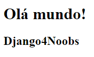

# 4.6 - Views

## O que são views?

> Uma view é onde ficará a lógica do nosso aplicativo. Ela será responsável por extrair as informações do nosso model e
> exibi-la no template.

## Criando um View

Anteriormente criamos nosso template.

Para defini-lá, iremos abrir o arquivo **views.py** do app **"blog4noobs"**.

Neste arquivo teremos o seguinte trecho de código:

```bash
from django.shortcuts import render

# Create your views here.
```

Como escrito no comentário, nele criaremos nossas Views. Iremos criar a View anteriormente já definida (**"publicar"**).

Utilize o trecho de código abaixo:

```bash
from django.shortcuts import render

def publicar(request):
    return render(request, "publicar.html")
```

## Vamos testar o que foi criado até agora!

No terminal de sua IDE, digite o comando abaixo:

```bash
python3 manage.py runserver
```

Se tudo ocorreu bem, você deverá ver uma mensagem como:

```bash
Starting development server at http://127.0.0.1:8000/
Quit the server with CTRL-BREAK.
```

Após isso, vá ao link indicado no terminal ou utilize o link no código acima e você deverá ter um resultado como na
imagem abaixo:
<p align="center">

</p>
