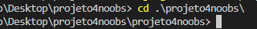
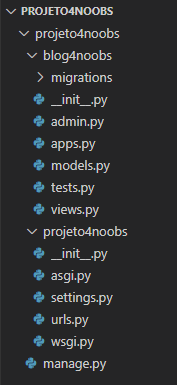

# 4.2 - Criando nosso primeiro módulo

Já criamos nosso projeto com o *startproject*, mas precisamos criar nosso módulo.

Para isso utilizaremos o *startapp*. O *startapp* cria um módulo/app, que vão ser criados conforme o projeto.

Primeiramente vamos navegar para dentro da pasta do projeto. Podemos entrar na pasta do projeto utilizando o comando
abaixo:

```bash
cd .\projeto4noobs\
```

Então estaremos dentro da pasta do projeto, veja:



Após isso poderemos criar nosso app sem problemas.

Para criar o app, rode o comando abaixo no terminal da sua IDE:

```bash
django-admin startapp blog4noobs
```

Uma nova pasta será criada com o nome que definimos (blog4noobs), esta pasta será nosso módulo:



### O que é um módulo?

> Suponhamos que temos um projeto de e-commerce que tenha um blog. Um dos módulos seria o e-commerce e o outro o blog.
> Seguindo o conceito desta estrutura, teremos 2 módulos em um projeto.

### Conclusão:

**Nesta aula você aprendeu como criar um módulo e o que é um módulo, na próxima aula aprenderemos como criar nossas models**

Ir para: [4.3 - Models](3-Models.md)