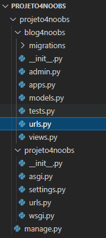

# 4.4 - Configurando as URLs

Com o projeto e app criados, podemos agora partir para a configuração do projeto.

### Nota:

> Para cada app que criamos, teremos que registrá-lo nas configurações.

Então iremos abrir o arquivo para configurar, o arquivo será o settings.py

No projeto que criamos anteriormente, o caminho será:

> projeto4noobs/projeto4noobs/settings.py

Iremos adicionar a constante do nosso app na no trecho **INSTALLED_APPS** dentro do arquivo **settings.py** para que o
módulo
seja registrado.

O nome app que definimos anteriormente é "blog4noobs", então deverá ficar assim:


Após isso, teremos que criar um arquivo **"urls.py"** dentro da pasta blog. Que ficará assim:



Iremos abrir este arquivo para configurar as urls do nosso app "blog4noobs".

Dentro deste arquivo, iremos configurar com o seguinte trecho de código:

```bash
from django.urls import path
from . import views

urlpatterns = [
    path('', views.publicar, name='publicar'),
]
```

Note que no trecho de código estamos importando todas as views, e referenciando uma view chamada **"publicar"**, porém não temos ela ainda e iremos criar
posteriormente.

Agora temos que configurar no arquivo de URLs principal.

No projeto que criamos anteriormente, o caminho será:

> projeto4noobs/projeto4noobs/urls.py

O código deverá estar assim:


Então iremos importar o **include** do **django.urls** e referenciar a url em **urlspatterns**.

Nosso resultado será o seguinte:


### Nota:

> - **path:** Este método é responsável por criar as urls, ele recebe parâmetros como o próprio path e a view ou o
    conjunto de views que serão acessadas;
> - **include:** Este método serve para que possamos incluir um conjunto de views.

Este arquivo é muito importante, e representa todas as URLs do nosso projeto. Todas as URLs que criamos no app "blog4noobs" serão importadas a partir da linha:

```bash
path('', include('blog4noobs.urls')),
```

### Conclusão:

**Nesta aula você aprendeu como criar as URLs do nosso projeto, na próxima aula aprenderemos como criar nossa view para exibir ao usuário**

**Bons estudos !!**

Ir para: [4.4 Views](5-Views.md)
