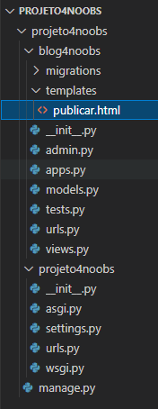

# 4.5 - Templates

## O que são?

> Os templates são responsáveis pelo definição de layout
> Templates no Django são nossos arquivos de textos, que podem ser convertidos em documentos de diferentes linguagens.
> Como por exemplo: HTML, CSS, JavaScript, etc...
> Os templates são compostos por três elementos: *Variáveis*, *Tags* e *Filtros*.
> - **Variáveis:** elementos que podem se se tornar valores ou serem substituídos;
> - **Tags:** responsáveis por controlar a lógica do template;
> - **Filtros:** responsáveis pelas funcionalidades do template.

## Criando um Template

Vamos criar nossa pasta de **templates**, essa pasta irá conter nossos arquivos HTML. Nessa pasta o Django irá procurar
nossas views anteriormente referenciadas.

Crie uma pasta com o nome **templates** dentro da pasta do seu app (blog4noobs).

Dentro da pasta templates, crie um arquivo *HTML* com o nome do template definido anteriormente (**publicar.html**).
<p align="center">

</p>
Neste arquivo HTML iremos inserir o seguinte trecho de código:

```bash
<!DOCTYPE html>
<html lang="pt-br">
<head>
    <meta charset="UTF-8">
    <meta http-equiv="X-UA-Compatible" content="IE=edge">
    <meta name="viewport" content="width=device-width, initial-scale=1.0">
    <title>Django4Noobs - He4rt Developers</title>
</head>
<body>
    <h1>Olá mundo!</h1>
    <h2>Django4Noobs - He4rtDevelopers</h2>
</body>
</html>
```

Esta será nossa página HTML inicial .

### Conclusão:

**Nesta aula você aprendeu como criar um template e pra que servem os templates, na próxima aula aprenderemos como criar
nossa view para exibir ao usuário**

**Bons estudos !!**

Ir para: [4.6 - Views](6-Views.md)
